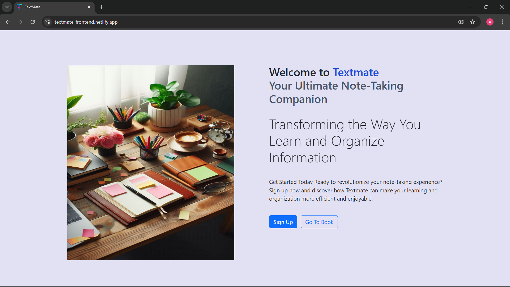
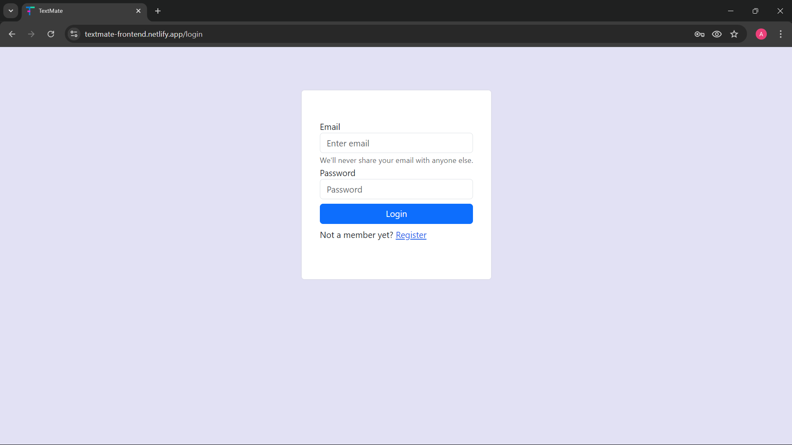
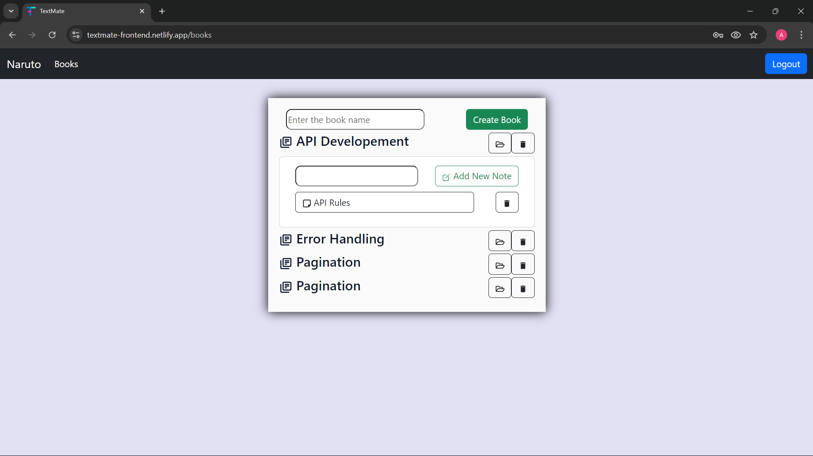
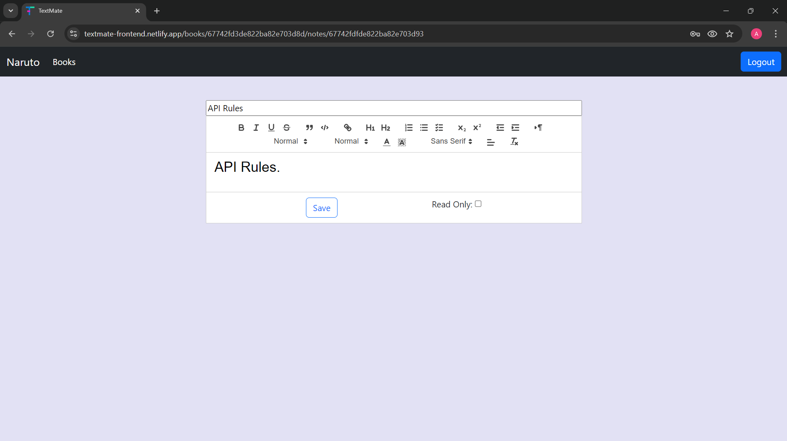

---

### TextMate - Older Version  

#### Setup Instructions:  
1. Clone the repository and navigate to the project directory.  
2. Run the following commands to install dependencies and start the development server:  
   ```bash  
   npm install  
   npm run dev  
   ```  

3. Configure the backend by following the instructions provided at [Textmate Backend Old](https://github.com/amitskingh/textmate-app-backend-older-version).  

---

### Screenshots:

1. **Home Page**  
   
2. **Login Page**  
   
3. **Library View**  
   
4. **Editor**  
   

---
